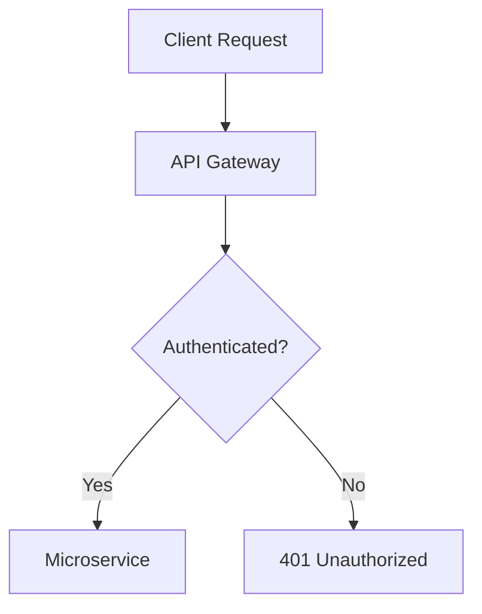

---
hide:
  - navigation # Hides the left navigation bar on the homepage for a clean landing page feel
---

# Welcome to Project Documentation

> **Fast, reliable, and developer-friendly documentation.**

Welcome to the official technical documentation. Here you will find comprehensive guides, API references, and architectural overviews to help you get up and running quickly.

---

## Quick Navigation

-   :material-rocket-launch:{ .lg .middle } **Getting Started**

    ---

    Learn how to install dependencies, set up your configuration, and run your first quickstart.

    [:octicons-arrow-right-24: Start Setup](getting-started.md)

-   :material-book-open-page-variant:{ .lg .middle } **User Guide**

    ---

    Deep dive into key workflows, component architectures, and configuration options.

    [:octicons-arrow-right-24: Read Guide](guide/index.md)

-   :material-api:{ .lg .middle } **API Reference**

    ---

    Explore endpoints, parameters, data models, and request/response examples.

    [:octicons-arrow-right-24: View API](api/reference.md)

-   :material-help-circle:{ .lg .middle } **Troubleshooting**

    ---

    Find answers to common issues, error codes, and frequently asked questions.

    [:octicons-arrow-right-24: Get Help](faq.md)

---

## Important Announcements

!!! note "Version 2.0 is Live!"
    We have fully redesigned the system architecture. If you are upgrading from `v1.x`, please check out our [Migration Guide](getting-started.md#migration).

!!! warning "Deprecation Notice"
    Legacy authentication methods via HTTP Header tokens will be retired on December 31. Please migrate to OAuth2 Bearer tokens.

---

## System Overview

Here is a quick snapshot of the core architecture stack:

| Component | Technology | Version |
| :--- | :--- | :--- |
| **Core Engine** | Python | `3.11+` |
| **Database** | PostgreSQL | `15.0` |
| **Frontend UI** | React / TypeScript | `18.2` |
| **Documentation** | MkDocs Material | `9.5+` |

---

## Code Example

Here is how simple it is to initialize the project via CLI:

```bash
# Clone the repository
git clone [https://github.com/YOUR-USERNAME/YOUR-REPO.git](https://github.com/YOUR-USERNAME/YOUR-REPO.git)

# Move into project directory and run setup
cd YOUR-REPO
pip install -r requirements.txt
python main.py --run
```

## Diagram example




